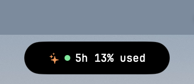
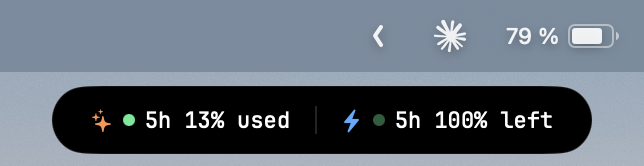
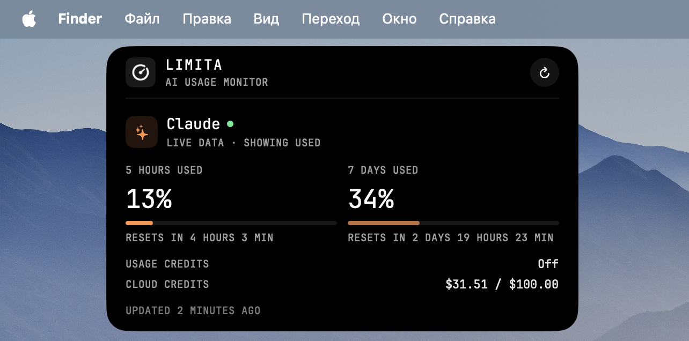
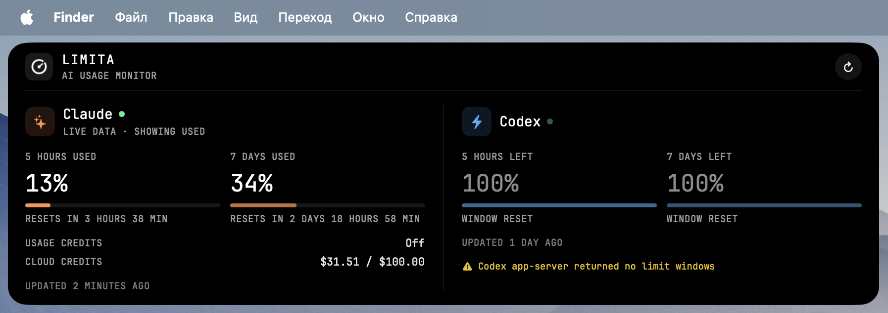

<p align="center">
  <picture>
    <source media="(prefers-color-scheme: dark)" srcset="docs/banner-dark.png">
    
  </picture>
</p>

<p align="center">
  <b>Claude Code and Codex rate limits, one glance from the top of your Mac.</b>
</p>

<p align="center">
  
  
  
  
</p>

---

Limita is a tiny native menu-bar app that shows how much of your **Claude** and **Codex** 5-hour and weekly limits you have, without opening a terminal.

## Features

- **Hover pill.** Rest the cursor at the top edge of any screen and a compact pill slides in with each service's 5-hour limit. Click it for the full dashboard.
- **Stays away from the notch.** The camera housing plus 80 pt on each side is left to other apps: nothing triggers or draws there.
- **Menu bar.** Left-click the icon for the dashboard, right-click for the menu. Clicking elsewhere closes it. The button next to **↻** in the dashboard hides or shows the icon until Limita quits; the icon is back on every launch. While it is hidden, the menu is out of reach, so show the icon again to connect or disconnect a service or to quit.
- **Only what you use.** Connect or disconnect Claude Code and Codex from the menu; disconnected services are neither shown nor queried. On first launch Limita connects whatever it finds installed.
- **Live numbers.** Claude is queried every 3 minutes, Codex every 5 minutes, and both on **Refresh**; local sources are re-read every minute.
- **Balances.** Codex limit resets and credits (credits and USD, $1 = 25 credits); Claude usage credits and cloud session credits. Rows a service does not report are hidden.
- **Readable at a glance.** Claude shows what is **used**, Codex what is **left**, and the dashboard labels which is which. Each service's dot follows its 5-hour limit: green, yellow from 70 % used (30 % left), red from 90 %; stale data keeps its colour, dimmed. Percentages stay plain white, and the dashboard counts down to each reset to the minute. If a live update fails, the reason is shown right in the dashboard.
- Multiple displays and full-screen Spaces. JetBrains Mono everywhere.

# Screenshots

This is how Limita looks on your Mac.

<p align="center">
  
  
</p>

<p align="center">
  
</p>

<p align="center">
  
</p>

## Install

1. Download `Limita-<version>.dmg` from [Releases](../../releases).
2. Open it and drag **Limita** into **Applications**.
3. The build is not notarized yet, so the first launch needs one extra step: right-click **Limita** in Applications → **Open** → **Open**. On recent macOS versions, use **System Settings → Privacy & Security → Open Anyway** instead.

Limita lives in the menu bar only; it has no Dock icon.

On the first Claude refresh, macOS asks whether Limita may read `Claude Code-credentials` from the Keychain. Choose **Always Allow**.

## Keeping Claude up to date

Claude Code's login token is **short-lived**, and only Claude Code itself renews it, while it is running. Limita reads that token but never renews it, because renewing it from outside could sign Claude Code out.

So after a long break from Claude Code, typically several hours, Claude's numbers stop updating:

- the dashboard shows **"Claude Code login expired … — open Claude Code to renew it"**;
- the last known numbers stay visible, dimmed and marked **STALE DATA**.

**To fix it, start Claude Code** (run `claude` in a terminal, or open it in your editor), then press **↻** in Limita or wait for the next refresh. Live data comes back as soon as Claude Code has renewed the login. Codex is not affected.

A long-lived token from `claude setup-token` does not help here: it only allows model requests, not reading usage limits.

## Data sources

| | Claude | Codex |
|---|---|---|
| **Live** | `GET api.anthropic.com/api/oauth/usage` with Claude Code's OAuth token | `codex app-server` → `account/rateLimits/read` (official; auth stays in the CLI) |
| **Fallback** | Claude Code status line, set up when you connect Claude Code | Latest `rate_limits` in `~/.codex/sessions/**/rollout-*.jsonl` |
| **Extras** | Usage credits, cloud session credits | Limit resets, credit balance |

**Claude usage API.** The endpoint is undocumented, the same one Claude Code's `/usage` uses, and it may change without notice. Limita reads the token from Claude Code's Keychain item `Claude Code-credentials`; macOS asks once. The token is only sent to `api.anthropic.com`. Limita never stores or refreshes it; see [Keeping Claude up to date](#keeping-claude-up-to-date).

**Claude status line.** **Connect Claude Code** in the menu adds Limita to `statusLine` in `~/.claude/settings.json`:

- An existing status line is wrapped, not replaced. Limita saves the limits and runs your command with the same input, so its output is unchanged.
- **Disconnect Claude Code** restores it. A backup is kept as `settings.json.limita-backup`.
- Connect from `/Applications`: a build-folder path disappears after a clean build.

## Privacy

- No accounts, cookies or passwords, and no analytics.
- Only rate-limit numbers and balances are read. Prompts, transcripts, project paths and session IDs are ignored.
- The Claude status-line cache (`~/Library/Application Support/Limita/claude-status.json`) holds only the two windows and a timestamp.

## Build from source

Requires macOS 14+, Xcode 15+ and [XcodeGen](https://github.com/yonaskolb/XcodeGen).

```bash
swift test
xcodegen generate
xcodebuild -project Limita.xcodeproj -scheme Limita -configuration Release build
```

`Limita.xcodeproj` is generated from `project.yml`. Run `xcodegen generate` after adding or removing files.

`scripts/make-dmg.sh` builds a Release copy and packages it as `build/Limita-<version>.dmg` with the drag-to-install window. Its background is rendered from `design/dmg-background-source.webp` by `scripts/dmg-background.py` (needs Pillow); rerun that after changing the layout.

Live-update failures are logged: `log show --predicate 'subsystem == "com.limita.app"' --last 1h`.

```text
Limita/
├── App/        lifecycle, status item, CLI entry for the status-line hook
├── Data/       readers, live clients, Claude status-line setup
├── Models/     limit windows, service state, balances
├── UI/         panel controller, pill, dashboard, layout, font
└── Resources/  app icon, menu-bar icon, bundled font
Tests/LimitaTests/
```

## License

MIT, see [LICENSE](LICENSE). The bundled JetBrains Mono Nerd Font is under the SIL Open Font License 1.1, see [THIRD_PARTY_NOTICES.md](THIRD_PARTY_NOTICES.md).

Limita is not affiliated with OpenAI or Anthropic.
