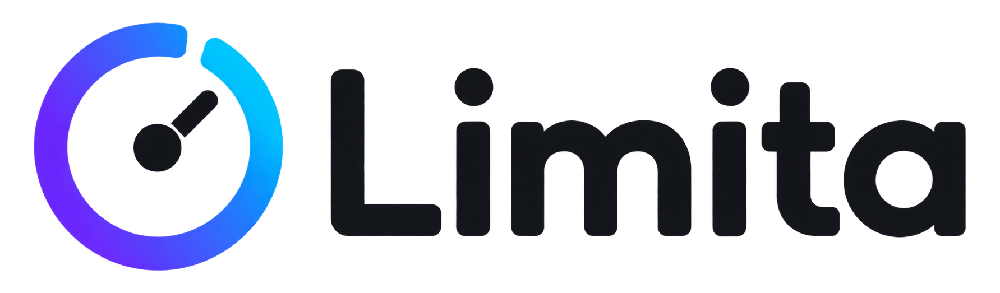

<p align="center">
  <picture>
    <source media="(prefers-color-scheme: dark)" srcset="docs/banner-dark.png">
    
  </picture>
</p>

<p align="center">
  <b>Codex and Claude Code rate limits, one glance from the top of your Mac.</b>
</p>

<p align="center">
  
  
  
  
</p>

---

Limita is a tiny native menu-bar app that shows how much of your **Codex** and **Claude** 5-hour and weekly limits you have, without opening a terminal.

## Features

- **Hover pill.** Rest the cursor at the top edge of any screen and a compact pill slides in with each service's 5-hour limit. Click it for the full dashboard.
- **Stays away from the notch.** The camera housing plus 80 pt on each side is left to other apps: nothing triggers or draws there.
- **Menu bar.** Left-click the icon for the dashboard, right-click for the menu. Clicking elsewhere closes it.
- **Live numbers.** Both services are queried every 20 minutes and on **Refresh**; local sources are re-read every minute.
- **Balances.** Codex limit resets and credits (credits and USD, $1 = 25 credits); Claude usage credits and cloud session credits. Rows a service does not report are hidden.
- **Readable at a glance.** Codex shows what is **left**, Claude what is **used**, and the dashboard labels which is which. Orange from 70 % usage, red from 90 %, yellow for stale data.
- Multiple displays and full-screen Spaces. JetBrains Mono everywhere.

## Install

1. Download `Limita-<version>.dmg` from [Releases](../../releases).
2. Open it and drag **Limita** into **Applications**.
3. The build is not notarized yet, so the first launch needs one extra step: right-click **Limita** in Applications → **Open** → **Open**. On recent macOS versions, use **System Settings → Privacy & Security → Open Anyway** instead.

Limita lives in the menu bar only; it has no Dock icon.

## Data sources

| | Codex | Claude |
|---|---|---|
| **Live** | `codex app-server` → `account/rateLimits/read` (official; auth stays in the CLI) | `GET api.anthropic.com/api/oauth/usage` with Claude Code's OAuth token |
| **Fallback** | Latest `rate_limits` in `~/.codex/sessions/**/rollout-*.jsonl` | Claude Code status line (**Connect** in the dashboard) |
| **Extras** | Limit resets, credit balance | Usage credits, cloud session credits |

**Claude usage API.** The endpoint is undocumented, the same one Claude Code's `/usage` uses, and it may change without notice. Limita reads the token from Claude Code's Keychain item `Claude Code-credentials`; macOS asks once. The token is only sent to `api.anthropic.com`. Limita never stores or refreshes it: if it expired, open Claude Code.

**Claude status line.** Connecting adds Limita to `statusLine` in `~/.claude/settings.json`:

- An existing status line is wrapped, not replaced. Limita saves the limits and runs your command with the same input, so its output is unchanged.
- **Disconnect Claude Code** in the menu restores it. A backup is kept as `settings.json.limita-backup`.
- Connect from `/Applications`: a build-folder path disappears after a clean build.

## Privacy

- No accounts, cookies or passwords, and no analytics.
- Only rate-limit numbers and balances are read. Prompts, transcripts, project paths and session IDs are ignored.
- The Claude status-line cache (`~/Library/Application Support/Limita/claude-status.json`) holds only the two windows and a timestamp.

## Build from source

Requires macOS 14+, Xcode 15+ and [XcodeGen](https://github.com/yonaskolb/XcodeGen).

```bash
swift test
xcodegen generate
xcodebuild -project Limita.xcodeproj -scheme Limita -configuration Release build
```

`Limita.xcodeproj` is generated from `project.yml`. Run `xcodegen generate` after adding or removing files.

```text
Limita/
├── App/        lifecycle, status item, CLI entry for the status-line hook
├── Data/       readers, live clients, Claude status-line setup
├── Models/     limit windows, service state, balances
├── UI/         panel controller, pill, dashboard, layout, font
└── Resources/  app icon, menu-bar icon, bundled font
Tests/LimitaTests/
```

## License

MIT, see [LICENSE](LICENSE). The bundled JetBrains Mono Nerd Font is under the SIL Open Font License 1.1, see [THIRD_PARTY_NOTICES.md](THIRD_PARTY_NOTICES.md).

Limita is not affiliated with OpenAI or Anthropic.
